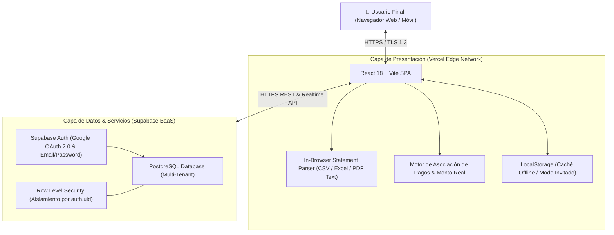
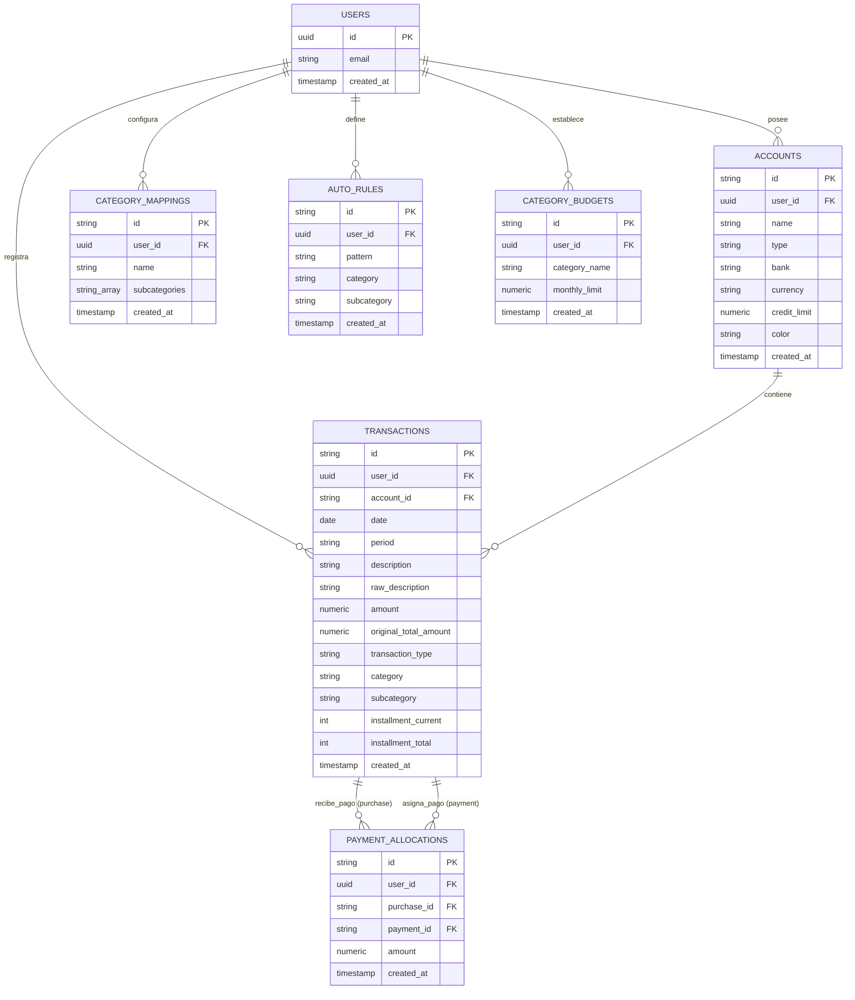
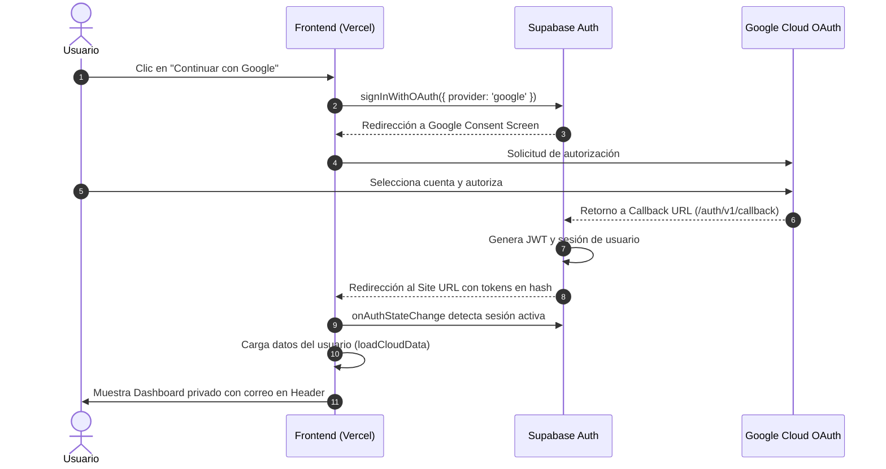
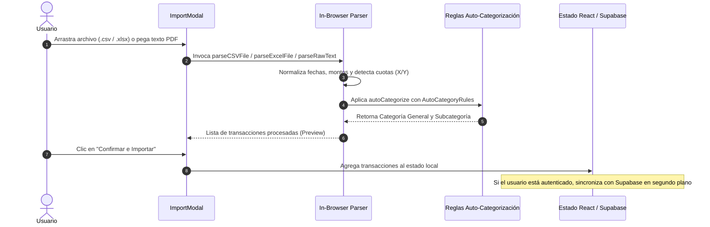
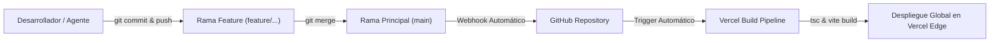

# 🏛️ Architecture Document - FinanzApp

## 1. Visión General de la Arquitectura
**FinanzApp** está construida bajo un patrón **JAMstack / BaaS (Backend-as-a-Service)** moderno, desacoplado y optimizado para costo operacional $0 USD en producción. La capa de cliente se ejecuta enteramente en el navegador del usuario utilizando React y TypeScript compilado con Vite, mientras que la autenticación, seguridad y persistencia relacional residen en Supabase (PostgreSQL).



---

## 2. Diagrama de Contenedores & Tecnologías

| Componente | Tecnología | Responsabilidad | Despliegue |
| :--- | :--- | :--- | :--- |
| **Cliente Web SPA** | React 18, TypeScript, Tailwind CSS, Vite | Renderizado de interfaz, visualización de métricas y gráficos, gestión de estado reactivo. | Vercel Global Edge Network |
| **Lector de Cartolas** | PapaParse, SheetJS (`xlsx`), RegEx Engine | Detección, normalización y parseo de columnas, montos, cuotas y fechas en memoria del cliente. | Ejecutado en el navegador del usuario |
| **Autenticación** | Supabase Auth + Google Cloud OAuth | Emisión y validación de tokens JWT (`sb-access-token`), gestión de sesiones de usuario. | Infraestructura Supabase |
| **Persistencia Relacional** | PostgreSQL 15 | Almacenamiento estructurado de cuentas, cartolas, asignaciones, categorías y presupuestos. | Supabase (Región São Paulo) |
| **Control de Acceso** | PostgreSQL Row Level Security (RLS) | Garantía a nivel de motor de BD de que ningún usuario acceda a datos ajenos (`auth.uid() = user_id`). | Supabase Engine |

---

## 3. Modelo de Datos (Entity-Relationship Diagram)



---

## 4. Flujos Clave de la Arquitectura

### 4.1. Flujo de Autenticación con Google (OAuth 2.0)


### 4.2. Flujo de Carga y Parseo de Cartola en el Navegador


### 4.3. Algoritmo de Asociación de Pagos y Saldo Real
Cada transacción tiene un estado base `amount` (monto facturado o cuota).
1. Un abono a la tarjeta de crédito se identifica por `transactionType === 'pago_tc'` o `amount < 0`.
2. Las asignaciones se registran en `payment_allocations`:
   * `purchase_id`: ID de la compra en la tarjeta.
   * `payment_id`: ID del movimiento de abono.
   * `amount`: Valor asignado.
3. El cálculo reactivo en `computeTransactions` genera:
   $$\text{totalAllocated} = \sum_{\text{allocations}} \text{amount}$$
   $$\text{netAmount} = \max(0, \text{amount} - \text{totalAllocated})$$
   $$\text{isFullyPaid} = (\text{netAmount} == 0)$$

---

## 5. Estrategia de Seguridad & Aislamiento (RLS)

> [!IMPORTANT]
> La seguridad de los datos no depende exclusivamente del código en el frontend, sino de las políticas estrictas de **Row Level Security (RLS)** evaluadas directamente por el motor PostgreSQL.

Cada tabla (`accounts`, `transactions`, `payment_allocations`, `category_mappings`, `auto_rules`, `category_budgets`) posee la siguiente regla:

```sql
CREATE POLICY "Strict Isolation" ON public.transactions
FOR ALL
USING (auth.uid() = user_id)
WITH CHECK (auth.uid() = user_id);
```

* **`USING`**: Filtra automáticamente cualquier consulta `SELECT`, `UPDATE` o `DELETE` para que solo devuelva o altere filas donde `user_id` coincida con el UUID del token de la sesión actual.
* **`WITH CHECK`**: Impide que un usuario intente insertar registros asignándolos al `user_id` de otro usuario.

---

## 6. Integración Continua y Despliegue (CI/CD)



1. **Variables de Entorno en Vercel**:
   * `VITE_SUPABASE_URL`: Dirección pública de la API de Supabase.
   * `VITE_SUPABASE_ANON_KEY`: Clave pública para clientes web (`anon` / `Publishable key`).
2. **Cero Secretos Expuestos**: Las claves de servicio (`service_role`) jamás se configuran en el cliente ni se suben a Git.
3. **Control de Ramas**: El desarrollo activo se realiza en ramas `feature/*` y solo se fusiona a `main` cuando el comando `npm run build` compila con cero errores.
