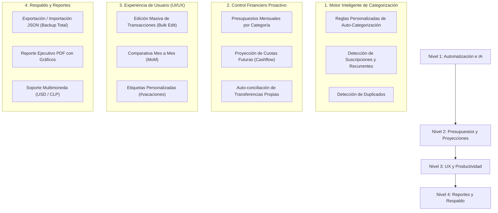

# 🚀 Plan de Mejoras Futuras - FinanzApp (Control de Cartolas & Tarjetas)

Este documento detalla una hoja de ruta estructurada con las mejores oportunidades de evolución para la aplicación web de gestión de cartolas bancarias, tarjetas de crédito y control de saldo real utilizado.

---

## 📊 Resumen Ejecutivo del Estado Actual

Actualmente la aplicación cuenta con un núcleo sólido de funcionalidades:
* ✅ **Soporte Multi-Cuenta**: Tarjetas de crédito, Cuentas Corrientes, Cuentas Vista/RUT y Cuentas de Ahorro.
* ✅ **Lectura Flexible de Cartolas**: Carga por CSV, Excel (`.xlsx`, `.xls`) y copiado/pegado de texto plano/PDF.
* ✅ **Reconocimiento de Cuotas y Períodos**: Detección automática de compras en cuotas (monto cuota vs. total contratado) y lectura de la columna personalizada `Mes-Periodo`.
* ✅ **Motor de Asociación de Pagos**: Cálculo de *Monto Real Utilizado* (saldo neto) asociando abonos/pagos a compras específicas.
* ✅ **Sistema Jerárquico de Categorización**: Categorías Generales y Subcategorías dinámicas con gestor modal.
* ✅ **Filtros Avanzados**: Multi-selección por Categoría General, Subcategorías, Período, Cuenta, Tipo de Transacción y Búsqueda textual.
* ✅ **Dashboard Interactivo**: Gráficos Recharts en tiempo real con alternancia entre Categoría y Subcategoría, y exportación de datos a Excel.

---

## 🎯 Hoja de Ruta de Mejoras Propuestas

---

## 📑 Detalle por Fase de Desarrollo

### 1. 🤖 Motor Inteligente de Categorización y Reglas Automáticas

> [!TIP]
> **Objetivo**: Reducir el trabajo manual al cargar cartolas mediante el aprendizaje automático de descripciones frecuentes.

* **Reglas de Auto-Categorización**:
  * Permitir al usuario crear reglas del tipo: *Si la descripción contiene "UBER", asignar a Categoría "Transporte" y Subcategoría "Taxis / Rideshare"*.
  * Botón para **"Aplicar Reglas a Movimientos Existentes"**.
* **Detección de Compras Recurrentes y Suscripciones**:
  * Identificar patrones mensuales constantes (ej. Netflix, Spotify, AWS, Gimnasio) y mostrar una tarjeta con el gasto fijo mensual estimado.
* **Detector de Transacciones Duplicadas**:
  * Alertar al usuario si al importar un archivo se detectan movimientos idénticos (misma fecha, monto y descripción) cargados previamente.

---

### 2. 📈 Presupuestos por Categoría y Proyección de Cuotas

> [!IMPORTANT]
> **Objetivo**: Transformar la app de un visor histórico a una herramienta de planificación financiera proactiva.

* **Presupuestos Mensuales (Budgets)**:
  * Definir topes máximos deseados por Categoría General o Subcategoría (ej. Max $150.000 en *Restaurantes & Bares*).
  * Barras de progreso visuales (Verde = <80%, Amarillo = 80-100%, Rojo = >100%) en el Dashboard.
* **Calendario y Proyección de Cuotas Futuras (Cashflow TC)**:
  * Vista de proyección a 3, 6 y 12 meses mostrando el compromiso de pago futuro generado por las compras en cuotas vigentes.
  * Gráfico de barras acumuladas con las cuotas por vencer en los próximos meses.
* **Auto-Conciliación de Transferencias Propias**:
  * Detectar cuando una transferencia enviada desde la *Cuenta Corriente* coincide con un abono o pago a la *Tarjeta de Crédito*, sugiriendo la asociación automática para evitar duplicar el conteo de gastos.

---

### 3. 🛠️ Productividad y Mejoras de UX/UI

* **Edición Masiva de Transacciones (Bulk Actions)**:
  * Casillas de selección en la tabla de transacciones para cambiar categoría, cambiar período asignado o eliminar múltiples movimientos simultáneamente.
* **Análisis Comparativo Mes a Mes (Month-over-Month)**:
  * Pestaña o gráfico comparativo para evaluar variaciones de gasto entre 2 o más meses seleccionados (ej. Comparar *Enero 2026* vs. *Febrero 2026* por categoría).
* **Etiquetas Personalizadas (Tags)**:
  * Permitir asociar una o varias etiquetas libres a las transacciones (ej. `#vacaciones-2026`, `#reembolsable-empresa`, `#remodelacion`).
  * Filtrar la cartola por etiquetas específicas.
* **Modo Oscuro (Dark Mode)**:
  * Alternador de tema en el Header para adaptar la interfaz a entornos oscuros.

---

### 4. 🔒 Respaldo, Portabilidad y Reportes Exportables

> [!CAUTION]
> **Objetivo**: Asegurar que los datos del usuario nunca se pierdan si se borra la caché del navegador y permitir compartir reportes.

* **Respaldo y Restauración de Base de Datos (JSON Backup)**:
  * Botones de **"Exportar Copia de Seguridad (.json)"** e **"Importar Copia de Seguridad"** para respaldar todas las cuentas, transacciones, reglas y asignaciones de pagos en un solo archivo.
* **Generación de Reportes PDF**:
  * Exportar un resumen ejecutivo en PDF listo para imprimir o enviar, incluyendo tarjetas de métricas, resumen por categoría y gráficos.
* **Soporte Multimoneda (CLP / USD)**:
  * Gestión de compras internacionales en tarjetas de crédito (monto en USD con conversión a CLP según tipo de cambio del período).

---

## ❓ Preguntas para Priorizar el Siguiente Paso

Para continuar con el desarrollo, ¿cuál de estas áreas te gustaría abordar primero?

1. **Opción A (Recomendada)**: **Reglas de Auto-Categorización + Presupuestos por Categoría**.
2. **Opción B**: **Proyección de Cuotas Futuras (Calendario de compromisos TC)**.
3. **Opción C**: **Edición Masiva en Tabla + Etiquetas Personalizadas (`#tags`)**.
4. **Opción D**: **Exportación/Importación de Respaldo Completo en JSON**.
